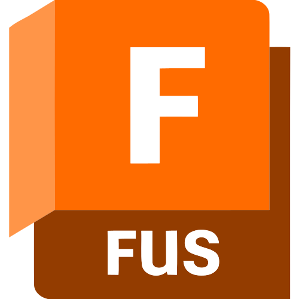

# hey im sahil 👋

im a hacker at [hack club](https://hackclub.com) building stuff at the intersection of hardware and software

## what im working on

- **[the pokemon WebOS](https://github.com/sahilchess/Pokemon-Web-OS)** — a pokemon themed webOS
- **[Prepping for USACO](USACO.org)** — worldwide competitive programming competitions
<!-- - **[sampletext](samplelink)** — sample desc -->

## tools i use

## find me

<!--  -->

## my stats

